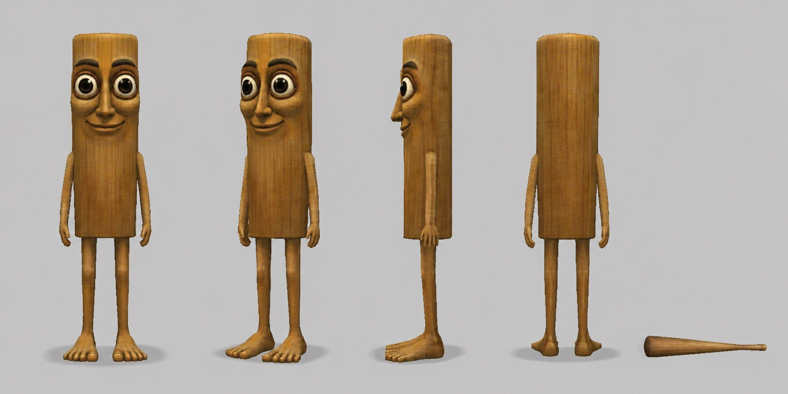

# TripleT Community Engine

An easy creative tool for making recognizable PS2-style images and short videos with TripleT / Tung Tung Tung Sahur.

You do not need to know prompting.

Tell the Engine what TripleT is doing. It handles the character reference, authentic PS2 gameplay grounding, camera direction, continuity, storyboards, animation prompts, and common repairs.

## What you need

- **A paid ChatGPT plan.** Personal Skills are not available on Free or Go. Managed workspaces may require admin approval.
- **Image generation in ChatGPT** for pictures. The Engine makes the image in the chat.
- **A video tool for video.** The Engine does not render video itself. It writes a prompt for Seedance, Kling, Sora, or another image-to-video tool. Those products and credits are separate.

## Install in ChatGPT

Install from [chatgpt.com](https://chatgpt.com) in a browser. If you also use the desktop app, add the Skill there separately.

1. Download [triplet-community-engine.zip](https://github.com/nosimajtechnology/triplet-community-engine/releases/latest/download/triplet-community-engine.zip). **Do not unzip it.**
2. In ChatGPT, open **Plugins** from the sidebar, then **Skills** -> **Create** -> **Upload from your computer**, and pick the zip.
3. Start a new chat.

Use this as your first prompt:

```text
Load the "TripleT Community Engine" skill.
```

Then describe your idea:

```text
TripleT walks through a quiet PS2 plaza while every NPC slowly turns to look.
```

If the first image looks right, reply `Approved.` If something is off, say exactly what:

```text
His body is too round. Restore the tall rectangular wooden silhouette and change nothing else.
```

## What you can make

- **IMAGE** — one finished picture
- **MINI** — one quick 4-8 second visual beat
- **SCENE** — an 8-15 second story moment
- **BUMPER** — a short loop or ident
- **FAKE AD** — a fictional in-engine commercial

Name a mode or let the Engine choose.

## Canonical TripleT reference

This turnaround is the Engine's primary identity authority. It locks TripleT's tall rectangular wooden body, vertical grain, eyes, brows, nose, smile, thin limbs, oversized bare feet, and wooden club design. Scenes, poses, props, expressions, and requested outfits may change.



## Start creating

- Read [START_HERE](./docs/START_HERE.md) for the shortest setup.
- Read the [COMMUNITY_GUIDE](./docs/COMMUNITY_GUIDE.md) for better results.
- Browse [EXAMPLE_IDEAS](./EXAMPLE_IDEAS.md) for ready-to-remix prompts.

Community creations are unofficial by default. This is a creative-production tool, not a trading tool. It does not provide price targets, return promises, or investment advice.

Explore the [TripleT community on X](https://x.com/tripletsol) and learn more about [Nosimaj Media](https://nosimaj.com).

